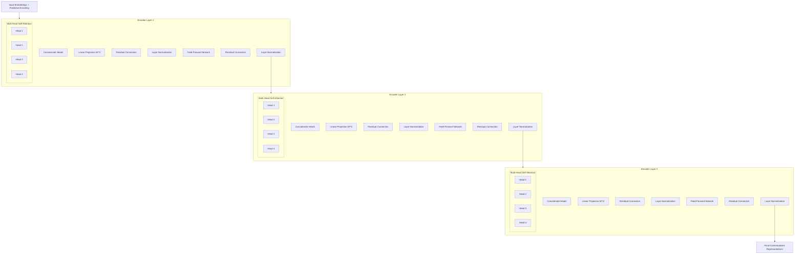

   

# LAB004: Transformers: Generation vs Extraction

## Introduction
This lab gives you hands-on experience with two fundamentally different transformer architectures. You'll run a **decoder model** (Qwen 2.5) that *generates* free-form text, and an **encoder model** (RoBERTa) that *extracts* an answer span from a given context. Understanding this distinction is essential before working with higher-level frameworks in later labs.

Both scripts run on CPU and require no API keys; everything is local.

## Set up your environment

### Prerequisites
- Python 3.10+ with pip and venv
- Docker and Docker Compose (for the containerised option)
- ~1 GB disk space for model downloads

### Setup Commands

#### Option A: Local Python
Create the virtual environment and install the dependencies (`numpy`, `transformers`, `torch`):
```bash
./lab_setup.sh
```
```bash
source .lab004/bin/activate
```
Run the scripts (the first run downloads the models, ~1 GB):
```bash
python3 demo.py
python3 roberta.py
```

#### Option B: Docker (Recommended)
Build and start the container. The lab folder is mounted as a volume, so any edits you make on your host (changing a prompt, tweaking temperature, etc.) are immediately available inside the container.
```bash
docker compose up -d --build
```

Open an interactive shell inside the running container:
```bash
docker exec -it lab004_app bash
```
From here you can run either script exactly as described below.

Or run a script directly without entering the container:
```bash
docker exec -it lab004_app python demo.py
docker exec -it lab004_app python roberta.py
```

Rebuild without cache if needed:
```bash
docker compose build --no-cache && docker compose up -d
```

When you're done, tear down the container:
```bash
docker compose down
```

## Lab instructions

### Example 1: Causal Text Generation with Qwen (demo.py)

**Architecture:** Decoder-only (autoregressive). The model predicts one token at a time, left to right.

**Model:** [Qwen/Qwen2.5-0.5B](https://huggingface.co/Qwen/Qwen2.5-0.5B), 0.5 B parameters, CPU-friendly.

**What the script does:**
1. Loads the Qwen tokenizer and model in FP32 on CPU
2. Tokenizes a security-themed prompt about the Log4j exploit
3. Generates up to 1500 new tokens using sampling (`temperature=0.7`, `top_p=0.9`)
4. Decodes and prints the full output

```bash
python3 demo.py
```

**Things to observe:**
- The output is *generated* text: the model continues the prompt, it does not look anything up.
- Generation quality varies between runs because `do_sample=True` introduces randomness.
- Try changing the prompt, temperature, or `max_new_tokens` to see how the output changes.

**Key code patterns:**
```python
# Tokenize → generate → decode  (the universal decoder pattern)
inputs = tokenizer(prompt, return_tensors="pt").to(device)
outputs = model.generate(inputs["input_ids"], max_new_tokens=1500, ...)
response = tokenizer.decode(outputs[0], skip_special_tokens=True)
```

### Example 2: Extractive Question Answering with RoBERTa (roberta.py)

**Architecture:** Encoder-only (bidirectional). The model reads the full input at once and scores every token as a possible answer start/end.

**Model:** [deepset/roberta-base-squad2](https://huggingface.co/deepset/roberta-base-squad2), 125 M parameters, fine-tuned on SQuAD 2.0.

**What the script does:**
1. Loads the RoBERTa tokenizer and model (`AutoModelForQuestionAnswering`) on CPU
2. Tokenizes the question and the context paragraph *together*
3. Runs the model, which scores every token as a possible answer start and end
4. Picks the best start/end tokens and decodes that span back to text

```bash
python3 roberta.py
```

**Expected output:**
```
Question: Who wrote The Hobbit?
Context: ... The Hobbit is a fantasy novel by J. R. R. Tolkien ...
Answer: J. R. R. Tolkien
```

**Things to observe:**
- The model *extracts*, meaning it can only return text that already exists in the context. It cannot generate new text.
- Try asking a question that isn't answerable from the context (e.g. *"What year was it published?"*). The model then points at the first token `<s>`, which is how SQuAD 2.0 models say *"no answer"*.
- Compare with `demo.py`: same tokenize → model → decode flow, but here the model outputs two scores per token (start/end) instead of predicting the next token.

**Key code patterns:**
```python
# Tokenize (question + context) → model → pick best span → decode
inputs = tokenizer(question, context, return_tensors="pt")
outputs = model(**inputs)
start, end = outputs.start_logits.argmax(), outputs.end_logits.argmax()
answer = tokenizer.decode(inputs["input_ids"][0][start : end + 1])
```

### Example 3 (optional): Serve Qwen as an API with vLLM

So far you called the model *directly* from Python. In the next lab you'll call an LLM over HTTP with `curl`. This optional example connects the two: [vLLM](https://docs.vllm.ai) wraps the same Qwen model in an OpenAI-compatible HTTP server, so the `curl` commands from LAB010 work against your own machine.

> **Requires an NVIDIA GPU.** vLLM also has a CPU build (slower), see the [vLLM CPU docs](https://docs.vllm.ai/en/latest/getting_started/installation/cpu.html).

Start the server (this pulls a large image on first run):
```bash
docker compose -f docker-compose.vllm.yml up -d
```

Wait until the model is loaded, then check which models are served:
```bash
curl http://localhost:8000/v1/models | jq
```

Send a chat request, exactly like the OpenAI Chat Completions API (no API key needed):
```bash
curl -XPOST http://localhost:8000/v1/chat/completions \
  -H "Content-Type: application/json" \
  -d '{
    "model": "Qwen/Qwen2.5-0.5B-Instruct",
    "messages": [
      {"role": "user", "content": "Explain me what the Log4j exploit issue is about ?"}
    ]
  }' | jq
```

**Things to observe:**
- Under the hood the server does the same tokenize → generate → decode loop as `demo.py`, just behind an HTTP endpoint.
- We use the **Instruct** variant of Qwen here: chat endpoints expect a model trained to follow a chat template (system/user/assistant roles).
- The request/response format is the OpenAI one, so any OpenAI client library can point to `http://localhost:8000/v1` instead of `api.openai.com`.

Stop the server:
```bash
docker compose -f docker-compose.vllm.yml down
```

### Decoder vs Encoder: Side by Side

| | demo.py (Qwen) | roberta.py (RoBERTa) |
|---|---|---|
| **Architecture** | Decoder-only (causal) | Encoder-only (bidirectional) |
| **Task** | Text generation | Extractive QA |
| **Output** | New text the model invents | Span from the input context |
| **Parameters** | 0.5 B | 125 M |
| **Loading style** | `AutoModelForCausalLM` + `generate()` | `AutoModelForQuestionAnswering` + forward pass |
| **Randomness** | Yes (`do_sample=True`) | No (deterministic extraction) |

## Transformer Encoder Architecture Reference
<details>
<summary>Transformer model encoder diagram (3 layers, 4 attention heads)</summary>


```mermaid
flowchart TD

%% Input
A[Input Embeddings + Positional Encoding]

%% Layer 1
subgraph L1["Encoder Layer 1"]
    subgraph H1["Multi-Head Self-Attention"]
        H1a[Head 1]
        H1b[Head 2]
        H1c[Head 3]
        H1d[Head 4]
    end
    Hcat1[Concatenate Heads]
    Hlin1[Linear Projection W^O]
    R1[Residual Connection]
    N1[Layer Normalization]
    F1[Feed-Forward Network]
    R1b[Residual Connection]
    N1b[Layer Normalization]
end

%% Layer 2
subgraph L2["Encoder Layer 2"]
    subgraph H2["Multi-Head Self-Attention"]
        H2a[Head 1]
        H2b[Head 2]
        H2c[Head 3]
        H2d[Head 4]
    end
    Hcat2[Concatenate Heads]
    Hlin2[Linear Projection W^O]
    R2[Residual Connection]
    N2[Layer Normalization]
    F2[Feed-Forward Network]
    R2b[Residual Connection]
    N2b[Layer Normalization]
end

%% Layer 3
subgraph L3["Encoder Layer 3"]
    subgraph H3["Multi-Head Self-Attention"]
        H3a[Head 1]
        H3b[Head 2]
        H3c[Head 3]
        H3d[Head 4]
    end
    Hcat3[Concatenate Heads]
    Hlin3[Linear Projection W^O]
    R3[Residual Connection]
    N3[Layer Normalization]
    F3[Feed-Forward Network]
    R3b[Residual Connection]
    N3b[Layer Normalization]
end

%% Connections
A --> L1
N1b --> L2
N2b --> L3
N3b --> Z[Final Contextualized Representations]
```
</details>

## File structure
```
lab004_transformers/
├── demo.py                 # Causal text generation with Qwen 2.5
├── roberta.py              # Extractive QA with RoBERTa
├── Dockerfile              # Container build (Python 3.13-slim)
├── docker-compose.yml      # Compose config (interactive shell, volume mount)
├── docker-compose.vllm.yml # Optional: vLLM OpenAI-compatible server (GPU)
├── requirements.txt        # Local dependencies (numpy, transformers, torch)
├── requirements_docker.txt # Docker dependencies (numpy, transformers, torch)
└── README.md
```

## Cleanup environment

### Local Python
```bash
deactivate
```
```bash
./lab_cleanup.sh
```

### Docker
Stop and remove the container:
```bash
docker compose down
```

Remove the image to reclaim disk space (~1 GB for model layers):
```bash
docker rmi $(docker compose images -q)
```

If you ran the optional vLLM example:
```bash
docker compose -f docker-compose.vllm.yml down
```

If you also want to remove the downloaded model cache:
```bash
docker volume prune
```

Back to [Lab Overview](https://github.com/kubiosec-agentic/agentic-labs/blob/master/README.md#-lab-overview)
