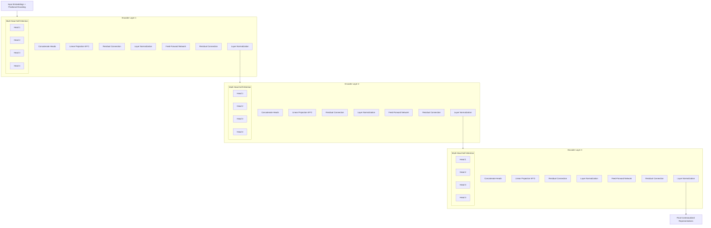

# LAB004 - LLM Security Analysis with Qwen Model
## Set up your environment

### Local Python Setup
```bash
export OPENAPI_API_KEY="xxxxxxxxx"
```
```bash
./lab_setup.sh
```
```bash
source .lab004/bin/activate
```

### Docker Setup (Recommended)
```bash
# Build and run with Docker Compose
docker-compose up --build

# Rebuild without cache if needed
docker-compose build --no-cache
```

## Lab instructions
### Running the Security Analysis Demo

This lab demonstrates using the Qwen2.5-0.5B model explaining the Log4j issue.

**Features:**
- Uses Qwen/Qwen2.5-0.5B model (CPU-friendly, lightweight)
- Containerized deployment with Docker
- Example security prompts included

**Model Information:**
- Model: Qwen/Qwen2.5-0.5B
- CPU optimized for local development
- Generates security analysis responses

**Related Resources:**
https://huggingface.co/fdtn-ai/Foundation-Sec-8B 

## Bonus

## Transformer Encoder (3 Layers, 4 Attention Heads each)
<details>
<summary>Transmformer model encoder drawing</summary>


</details>

## Cleanup environment
```
deactivate
```
```
./lab_cleanup.sh
```
Back to [Lab Overview](https://github.com/kubiosec-agentic/agentic-labs/blob/master/README.md#-lab-overview)
