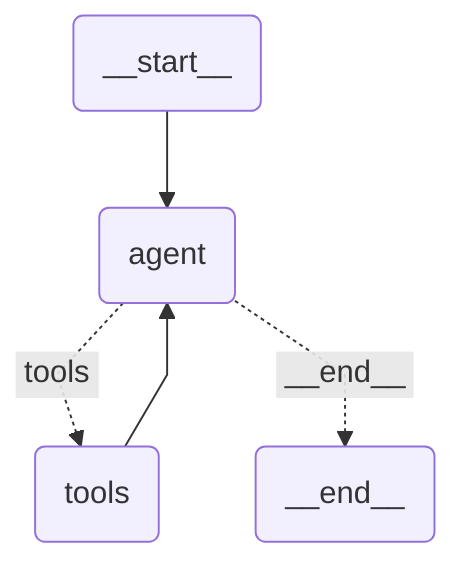

   

# LAB064: LangGraph, from Hello-World to Vulnerable Agent

## Introduction

LangGraph is the graph-based successor to the classic LangChain `AgentExecutor`. Instead of a blackbox executor loop, you define your agent as an explicit `StateGraph`: nodes are functions that mutate a typed state, edges decide where to go next (linear, conditional, or cyclic), and the whole thing runs with a single `.invoke()` or `.astream()` call. A checkpointer (`MemorySaver`, `SqliteSaver`, or a custom one) turns any graph into a stateful, multi-turn agent without you writing a single line of session management.

This lab walks through the LangGraph building blocks on a simple tool-calling agent, then flips the same pattern into a security exercise. By the end you should understand both how to build a LangGraph agent and how to attack one.

## Set up your environment

```bash
export OPENAI_API_KEY="xxxxxxxxx"
```

```bash
./lab_setup.sh
source .lab064/bin/activate
```

The CTF stage also uses `flask` and `RestrictedPython`, both already in `requirements.txt`.

## Lab instructions

### Example 1: Tool-calling agent with LangGraph (`LG_01.py`)

The canonical LangGraph agent. A `StateGraph` with two nodes:

- `agent` calls the LLM (`ChatOpenAI` with `bind_tools`) on the current message history.
- `tools` executes any tool calls the LLM emitted and appends `ToolMessage` results to the state.

The edges wire it into a loop: `START -> agent`, then a conditional edge from `agent` that either routes to `tools` (if the last message contains tool calls) or to `END`. After `tools`, a plain edge goes back to `agent` so the LLM can see the tool results and either produce more tool calls or a final answer.

Two tools are exposed. `search_web` uses DuckDuckGo for current information, `calculate` evaluates math expressions in a whitelisted namespace. Both are defined with `@tool` and Pydantic input schemas so LangChain auto-generates the JSON schema that the LLM sees.

```bash
python3 ./LG_01.py
```

**What to observe:**

- The question ("current US president's age times 2 square rooted") forces the agent to chain tools: first `search_web` to get the age, then `calculate` on the result. Watch the `🔧 Calling ...` lines print in order.
- State flows through `MessagesState`, which is a `TypedDict` with an `add`-reducer on the `messages` field. Every node returns `{"messages": [new_message]}` and LangGraph appends, not replaces.
- `should_continue` is the routing function. It returns either `"tools"` or `END`. This is the smallest possible conditional edge, and it's the heart of a ReAct loop expressed as a graph.
- There is no `MemorySaver` here yet, so each `.invoke()` starts fresh. Add one and suddenly you have multi-turn chat without changing the nodes. The CTF stage does exactly this.

### Example 2: Visualizing the graph (`LG_02.py`)

Same agent as above, plus two extra lines at the end that dump the compiled graph as Mermaid. When you're designing workflows with conditional routing, this is how you sanity-check the topology without running it.

```bash
python3 ./LG_02.py
```

The script writes `graph.mermaid` to disk and also prints it to stdout. Here is what the rendered diagram looks like for the tool-calling agent:



The dotted edges from `agent` are the conditional ones: `should_continue` returns either `"tools"` (if the LLM emitted tool calls) or `END` (if it produced a final answer). The solid `tools -> agent` edge closes the ReAct loop. You can paste the file into [mermaid.live](https://mermaid.live) to explore interactively.

**Heads-up on a common gotcha.** If you call `add_conditional_edges` without an explicit `path_map`, LangGraph cannot statically resolve which node names the router returns, and `draw_mermaid()` will drop the conditional edges from the diagram entirely. Look at `create_agent()` in `LG_02.py` (and `LG_01.py`) for the fix: passing `{"tools": "tools", END: END}` as the third argument. Runtime behavior is unchanged either way, but the diagram becomes accurate.

**What to observe:**

- `graph.get_graph().draw_mermaid()` is the quickest way to get a shareable diagram of any compiled graph. There's also `draw_png()` if you have graphviz installed.
- Mermaid syntax is plain text, so you can commit the diagram alongside the code and it will render natively in GitHub, GitLab, VS Code, and most markdown viewers.
- For agents that grow beyond 5-6 nodes (multi-agent systems, human-in-the-loop workflows), the visualization is often the first thing you reach for when something routes incorrectly.

### Example 3: Typed-state workflow with conditional routing (`LG_03.py`)

A larger, genuinely different example: automated job application review. Instead of `MessagesState`, it defines a custom `JobApplicationState` `TypedDict` with typed fields (`job_description`, `candidate_name`, `is_suitable`, `review_score`, etc.) and an `add`-reduced action log. The graph has five nodes: analyze the job, generate a letter, review it, reject unsuitable candidates, and an entry node that routes conditionally based on `is_suitable`.

```bash
python3 ./LG_03.py
```

**What to observe:**

- This is the pattern you'll actually use in production. `MessagesState` is great for chat-style agents but real workflows have structured state that looks more like a database row than a conversation.
- The `Annotated[list[str], add]` reducer accumulates action-log entries across nodes. Any node that returns `{"actions_taken": ["did thing"]}` appends to the log instead of replacing it. This is how you build an audit trail.
- Conditional routing here is not ReAct-style (loop until done). It's business logic: branch to letter generation or rejection based on one boolean. Same primitive, different use case.
- The demo runs three candidate profiles against the same job posting. Alice is a strong match, Bob is a poor match, Carol is another strong match. Watch the scoring decisions and compare them against your own judgment. The "fallback logic" comments in the code show where the workflow degrades gracefully if the OpenAI API is unavailable.
- The job-review example is borrowed from the LangGraph community and is not originally security-focused. It's here so you see `TypedDict` state, multi-node pipelines, and conditional business routing before you meet the CTF, which reuses these primitives in an adversarial setting.

### Example 4: CTF, attacking and hardening a vulnerable agent (`ctf/`)

Now that you know how to build a LangGraph agent, let's attack one.

A four-stage security exercise built on the same pattern you saw in `LG_01.py`, but with a deliberately-weak Python code execution tool and a `MemorySaver` checkpointer that gives you multi-turn conversations. The agent is exposed as an OpenAI-compatible `/v1/chat/completions` endpoint, so you can attack it with `curl`, the `openai` Python client, or any other OpenAI-compatible tool.

Each stage adds one layer of defense. Each layer has a bypass. The lesson is not "how do I extract the flag", it's "how does each defense technique actually work, and what's its failure mode".

| Stage | Defense added | What you learn |
|-------|---------------|----------------|
| 1 | None | How cheap a dangerous tool makes the attack. Under two minutes to solve. |
| 2 | Regex output filter | Why filtering the output of a Turing-complete tool is a losing game (base64, ord, chunking). |
| 3 | Hardened system prompt | Prompt injection. The richest stage pedagogically. System prompts are suggestions, not access controls. |
| 4 | RestrictedPython sandbox | The attack surface shifts from the tool to the architecture: DoS, persistent checkpointer leakage, prompt-level extraction of context. |

```bash
cd ctf
python3 stage1_no_guardrails.py   # then stage2, stage3, stage4
```

See [ctf/README.md](./ctf/README.md) for the full walkthrough, attack techniques to try, and discussion questions for each stage.

## Key concepts across the lab

**State management.** `MessagesState` for chat-style agents, `TypedDict` for structured workflows, reducers (`add`, custom merge) for accumulating state across nodes.

**Graph topology.** Nodes are plain Python functions that take and return state. Edges are either unconditional (`add_edge`) or conditional (`add_conditional_edges` with a router function). Cycles are fine and expected (ReAct loops).

**Tool calling.** `ChatOpenAI.bind_tools([@tool-decorated functions])` produces an LLM that emits tool calls. A `tools` node in the graph dispatches them. The ReAct cycle is just a conditional edge that checks `last_message.tool_calls`.

**Checkpointers and sessions.** Pass `checkpointer=MemorySaver()` to `.compile()` and you get multi-turn memory scoped by `thread_id`. Swap for `SqliteSaver` to persist across restarts. The CTF uses this to turn a one-shot agent into a chatbot with conversational history (and attack surfaces).

**Visualization.** `graph.get_graph().draw_mermaid()` for a topology diagram. Essential once your graph has more than a handful of nodes or any non-trivial conditional routing.

**Attack surfaces.** Dangerous tools (code execution, file I/O), output filtering (fundamentally limited), prompt-level guardrails (fundamentally advisory), sandboxing (necessary but not sufficient), persistent session state (a new category of secret storage). All covered in the CTF.

## Resources

- [LangGraph documentation](https://langchain-ai.github.io/langgraph/)
- [LangGraph conceptual guides](https://langchain-ai.github.io/langgraph/concepts/)
- [LangGraph examples repo](https://github.com/langchain-ai/langgraph/tree/main/examples)
- [mermaid.live](https://mermaid.live) for interactive diagram editing
- [RestrictedPython](https://restrictedpython.readthedocs.io/) used in CTF stage 4

## Cleanup environment

```bash
deactivate
./lab_cleanup.sh
```

Back to [Lab Overview](https://github.com/kubiosec-agentic/agentic-labs/blob/master/README.md#-lab-overview)
