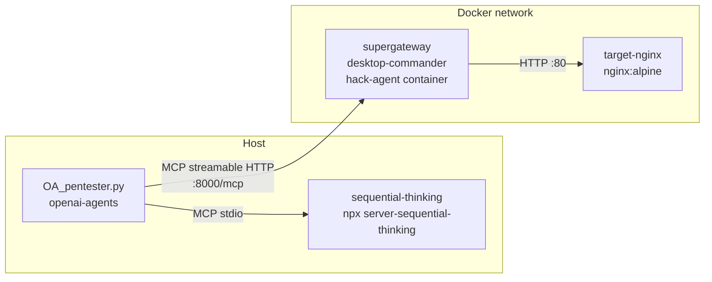

# Hacking Bot (teaser)

A tiny AI pentesting bot in ~100 lines, built on top of MCP. This is a
**teaser**, not a product: the point is to show how little wiring it
takes to turn "a sandboxed shell" plus "a reasoning scratchpad" into
something that looks and behaves like a very junior pentesting assistant,
and then to leave the hard parts (scope control, tool selection, result
triage, reporting) as homework.

## Architecture



Two MCP servers feed the agent:

1. **hack-agent**: a throwaway Ubuntu container with `desktop-commander`
   behind `supergateway`, exposed as streamable HTTP on
   `http://127.0.0.1:8000/mcp`. This is the shell. The agent can
   install missing scanners with apt, run them in the background, read
   files in /tmp, and clean up.
2. **sequential-thinking**: the reference
   `@modelcontextprotocol/server-sequential-thinking` server, running
   locally over stdio. It exposes a single `sequentialthinking` tool
   the model uses as a revisable scratchpad: it writes thoughts, marks
   some as revisions of earlier ones, branches when it explores an
   alternative, and marks a final thought when it is done thinking.
   Wiring this server in tends to make multi-step tool use much more
   coherent; the model is forced to name its plan before it runs
   anything, and it revisits the plan when findings change.

## Getting started

The whole lab (hacking box + nginx target) is wired up in
[`docker-compose.yml`](./docker-compose.yml). One command brings
everything online:

```bash
docker compose up -d --build
```

This builds `ubuntu-node-python` from the local Dockerfile, starts an
`nginx:alpine` container named `target-nginx` as the authorized lab
host, starts `hack-agent` with supergateway + desktop-commander exposed
on `http://127.0.0.1:8000/mcp`, and puts both containers on a private
docker network. The agent reaches the target by name
(`http://target-nginx:80`), so the lab works identically on macOS and
Linux with no host IP plumbing.

Watch the logs:

```bash
docker compose logs -f
```

Quick smoke test that the hacking box can actually see the target:

```bash
docker compose exec hack-agent curl -sI http://target-nginx/ | head -n1
# expected: HTTP/1.1 200 OK
```

Interactive shell (if you want to poke around inside the hacking box):

```bash
docker compose exec hack-agent bash
```

Tear the lab down when you are done:

```bash
docker compose down
```

## Sanity-check the MCP server first

Before you blame the agent, confirm port 8000 actually belongs to
desktop-commander and not to `server_streamable.py` left over from
exercise 2 or 7. Both bind to :8000 and the first one wins; docker's
port publish silently falls through to whatever grabbed the port first.

```bash
curl -sS -X POST http://127.0.0.1:8000/mcp \
    -H "Content-Type: application/json" \
    -H "Accept: application/json, text/event-stream" \
    -d '{"jsonrpc":"2.0","id":1,"method":"initialize","params":{"protocolVersion":"2024-11-05","capabilities":{},"clientInfo":{"name":"probe","version":"0"}}}'
```

Look at `serverInfo.name` in the response:

- `desktop-commander` → correct, you're good to go.
- `Echo Server` → fastmcp from exercise 2/7 is squatting the port.
  Kill it (`lsof -iTCP:8000 -sTCP:LISTEN`, then `kill <pid>`), restart
  the docker container, and re-run this check.

## Run a scan

If you did exercise 7 (MITM) in the same shell, unset the leftover
base URL first, otherwise the openai SDK will try to talk to the
mitmproxy reverse-proxy and fail with `APIConnectionError`:

```bash
unset OPENAI_BASE_URL
python3 ./OA_pentester.py
```

The script plans against a single authorized target, asks the
sequential-thinking server for a plan, uses hack-agent to install nikto
if needed, runs it in the background, polls, and summarizes the top
findings. Conversation history is kept in a local SQLite session
("hackingbot") so you can re-run and continue the same engagement.

## Configuring VS Code to talk to the same MCP server

Create `.vscode/mcp.json` so you can poke at the container's tools
directly from your editor:

```bash
mkdir -p .vscode
```

```json
{
    "servers": {
        "hack-agent": {
            "url": "http://127.0.0.1:8000/mcp",
            "type": "http"
        }
    },
    "inputs": []
}
```

## Where to take this next

The whole script is deliberately short. Obvious next steps, in rough
order of payoff:

1. **Scope enforcement**: add a deny-list of hostnames and refuse
   before running any network command that targets something outside
   the list. Right now the scope lives in the prompt, which is the
   cheapest place for it to fail.
2. **Tool selection**: give the agent a short menu of scanners with a
   description of when each is appropriate, instead of assuming nikto.
   Couple that with sequential-thinking to force a "which tool, why"
   step.
3. **Result triage**: teach the agent to grep findings for signatures
   worth following up and to save a machine-readable artifact
   alongside the raw scan output.
4. **Reporting**: plug in the `docx` or `pdf` skills to turn the
   conclusions into a real report rather than a paragraph of text. The
   `reporting/` subfolder here contains example outputs from earlier
   runs; use them as reference for the format you want.
5. **Observability**: wrap every tool call in the openai-agents tracer
   (already done via `trace(...)`) and add a mitmproxy in front of the
   MCP server to see the JSON-RPC on the wire. Pair with lab071 for
   Inspector.
6. **Safety rail**: put the destructive commands behind a human-
   confirmation gate. The agent is allowed to plan anything, but shell
   execution of anything that writes off-box has to be approved.

Each of those is about a half-day of work and each one is more
interesting than the original "run nikto and print the output". The
point of the teaser is to show you that the wiring is the easy part,
and that where you spend your time is on the judgment layer around
the tools.

## Security caveats

This bot has no scope controls beyond the system prompt, no command
allowlist, and full root inside the container. Do not run it against
anything you do not own. Treat it as a lab exercise only. The section
at the bottom of [../README.md](../README.md) (lab070) covers the
broader MCP security risks that apply here: tool shadowing, indirect
prompt injection through scan output, sampling abuse, confused deputy
at the container boundary, and supply-chain risk on every `npx -y`
line in the Dockerfile.
