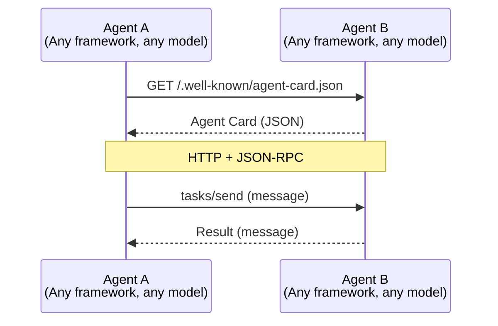
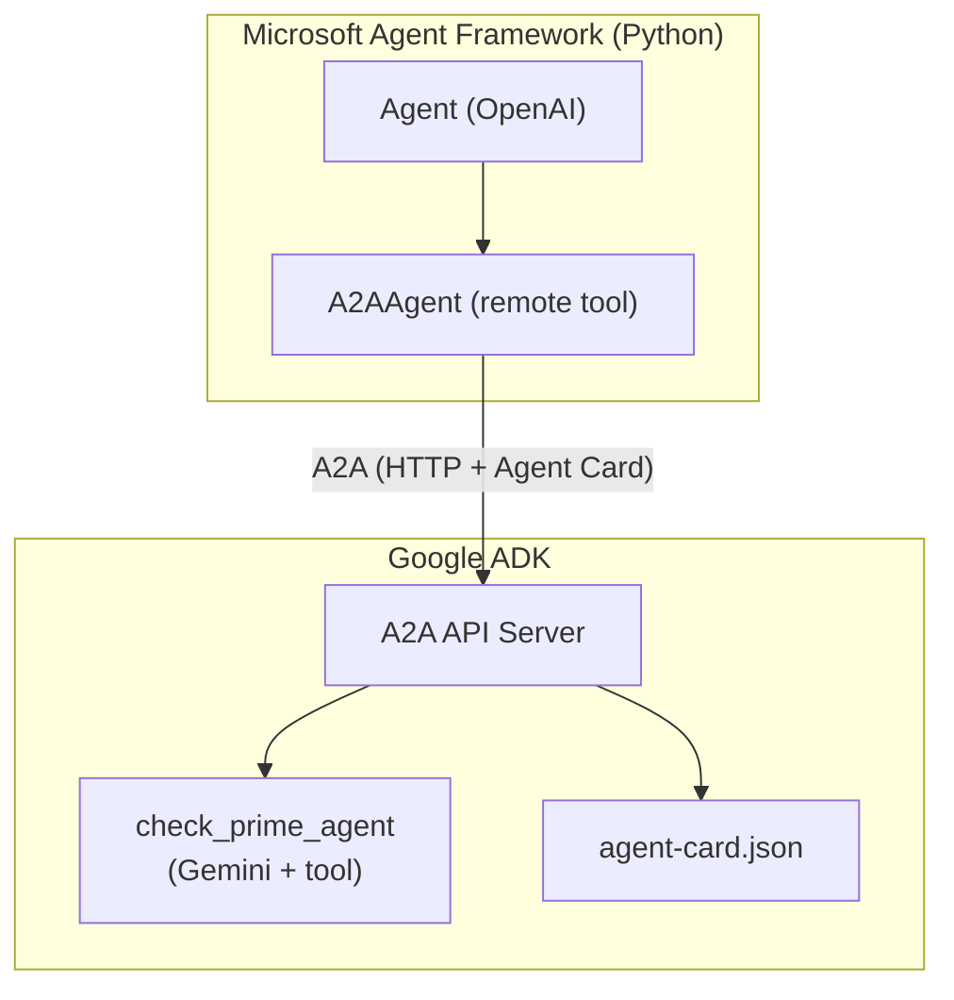
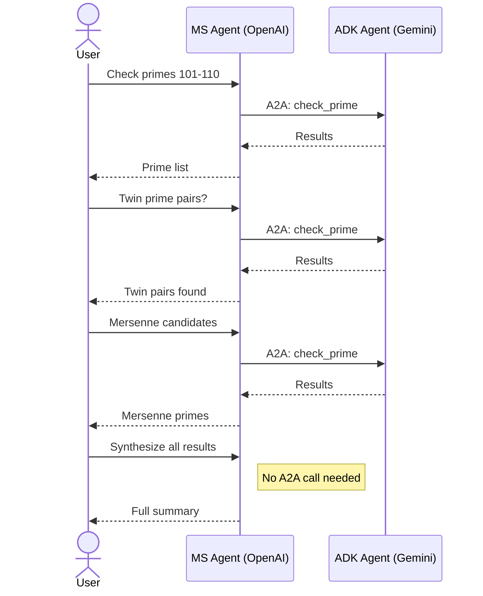

   

# LAB110: Agent-to-Agent Communication (A2A)

## Introduction

The A2A (Agent-to-Agent) protocol enables autonomous AI agents to discover, communicate, and collaborate across vendor boundaries. No shared SDK, runtime, or model is required. Agents publish an **agent card** at a well-known endpoint, and any compliant client can discover and invoke them.

A2A reached 1.0 GA in March 2026 under the Linux Foundation, with
backing from Google, Microsoft, Salesforce, and others. Unlike many
"open standards" in the AI space, A2A has real multi-vendor adoption
and is likely to remain the dominant agent interoperability protocol
for the foreseeable future. The official Python SDK (`a2a-sdk`) has
since shipped 1.x as GA, and the Microsoft `agent-framework-a2a`
package now requires it. See the Version Notes section below.

This lab has two parts:

- **Part 1** uses the official `a2a-samples` hello world to introduce the protocol basics: agent cards, discovery, message exchange, and the A2A Inspector.
- **Part 2** demonstrates real cross-vendor interoperability: a Microsoft Agent Framework client (OpenAI) discovers and invokes a Google ADK server (Gemini) via A2A, with a multi-turn bidirectional conversation.



## Set up your environment

```bash
export OPENAI_API_KEY="your_openai_api_key_here"
```

## Part 1: A2A Hello World

This part uses the official a2a-samples repository to introduce the protocol fundamentals.

### Step 1: Setup Hello World Agent (Terminal 1)

```bash
git clone https://github.com/a2aproject/a2a-samples.git
cd a2a-samples/samples/python/agents/helloworld
uv run .
```

This starts a simple A2A agent that listens for incoming messages and exposes an agent card for discovery.

### Step 2: Setup Hello World Client (Terminal 2)

```bash
cd a2a-samples/samples/python/agents/helloworld
uv run test_client.py
```

This demonstrates basic agent discovery, message exchange, and response handling.

### Step 3: Agent Discovery

Query the agent's self-description using the standard discovery endpoint:

```bash
curl http://127.0.0.1:9999/.well-known/agent-card.json | jq -r .
```

The agent card contains: agent metadata, available skills, supported input/output modes, and the service URL.

## Part 2: Cross-Vendor Interoperability (Microsoft + Google)

This part demonstrates a Microsoft Agent Framework client (OpenAI) communicating with a Google ADK server (Gemini) via A2A. Neither side knows what framework or model the other uses.



| File | What it does |
|------|-------------|
| `adk_server/setup.sh` | Setup the ADK server virtual environment |
| `adk_server/remote_a2a/check_prime_agent/agent.py` | ADK agent: prime number checker (Gemini) |
| `adk_server/remote_a2a/check_prime_agent/agent.json` | Agent card ADK serves (this is the file ADK reads; `agent-card.json` is an unused duplicate) |
| `MicrosoftAgentFramework/ms_client/setup.sh` | Setup the MS client virtual environment |
| `MicrosoftAgentFramework/ms_client/demo.py` | Single-shot demo: "Is 97 prime?" |
| `MicrosoftAgentFramework/ms_client/demo_conversation.py` | Multi-turn bidirectional conversation |
| `MicrosoftAgentFramework/test.py` | Quick agent card connectivity check |
| `test_agent_cards.sh` | Curl-based agent card verification (4 tests) |

### Step 5: Setup the ADK Server (Terminal 1)

```bash
cd adk_server
./setup.sh
source .venv/bin/activate
```

Configure authentication (choose one):

```bash
# Option A: Gemini API (simplest)
export GOOGLE_API_KEY="your-gemini-api-key"

# Option B: Vertex AI
export GOOGLE_GENAI_USE_VERTEXAI=true
export GOOGLE_CLOUD_PROJECT="your-project-id"
export GOOGLE_CLOUD_LOCATION="europe-west1"
gcloud auth application-default login
```

Start the A2A server:

```bash
adk api_server --a2a --port 8001 remote_a2a
```

### Step 6: Verify the Agent Card

From a separate terminal:

```bash
curl http://localhost:8001/a2a/check_prime_agent/.well-known/agent-card.json | python3 -m json.tool
```

Or run the full verification suite:

```bash
./test_agent_cards.sh
```

This runs 4 checks: card retrieval, field validation, skills inspection, and a test A2A task via JSON-RPC.

### Step 7: Setup the Microsoft Agent Framework Client (Terminal 2)

```bash
cd MicrosoftAgentFramework/ms_client
./setup.sh
source .venv/bin/activate
```

```bash
export OPENAI_API_KEY="sk-..."
export OPENAI_CHAT_MODEL="gpt-4o-mini"
```

### Step 8: Single-Shot Demo

```bash
python demo.py
```

The MS agent discovers the ADK agent via its agent card, wraps it as an `A2AAgent` tool, and asks "Is 97 prime?" The request crosses the A2A boundary: OpenAI reasons about the question, calls the remote Gemini agent, and returns the result.

### Step 9: Multi-Turn Bidirectional Conversation

```bash
python demo_conversation.py
```

A 4-turn conversation where the MS agent calls the ADK agent multiple times, building on previous results:

| Turn | What happens | A2A calls |
|------|-------------|-----------|
| 1 | Check primes 101-110 | prime_checker with 10 numbers |
| 2 | Check twin prime pairs from turn 1 results | prime_checker based on previous output |
| 3 | Check Mersenne candidates (3, 7, 31, 127, 2047, 8191) | prime_checker with 6 numbers |
| 4 | Synthesize all results across turns | No A2A call; agent summarizes from memory |



Each `prime_checker` call crosses the A2A protocol boundary. The MS agent maintains conversational context across turns and builds on previous results. Two different LLM vendors collaborate seamlessly.

## Key Concepts

**Agent Cards** are the foundation of A2A. Each agent publishes a JSON document at `/.well-known/agent-card.json` describing its name, capabilities, skills, and URL. Any compliant client can discover and invoke the agent without prior configuration.

**Service Discovery** follows a standard pattern: resolve the agent's base URL, fetch the card, parse the skills, and wrap the agent as a callable tool or direct A2A endpoint.

**A2A Tasks** use JSON-RPC over HTTP. A client sends `tasks/send` with a message, and the server responds with the agent's output. Tasks can be single-turn or multi-turn.

## Version notes

The A2A protocol reached 1.0 GA in March 2026 and is now a Linux
Foundation project. The protocol spec is stable, but the SDK
implementations are still catching up:

| Package | Version used here | Status |
|---------|-------------------|--------|
| A2A protocol spec | 1.0 | GA |
| `a2a-sdk` (Python) | 1.1.x | GA |
| `agent-framework-a2a` (Microsoft) | 1.0.0b260821 | Beta |
| `agent-framework-core` (Microsoft) | 1.15.x | GA |
| `google-adk` (Google) | 2.7.x | GA with A2A support |

The setup scripts now pin `a2a-sdk>=1.0,<2`. `agent-framework-a2a`
requires `a2a-sdk>=1.0` and `agent-framework-core>=1.15.0`; the older
`a2a-sdk>=0.3.26,<1.0` pin makes pip fail with `ResolutionImpossible`.

The ADK server also needs `a2a-sdk[http-server]`, not plain `a2a-sdk`.
`google-adk[a2a]` only depends on the bare SDK, which leaves out
`sse-starlette` — see Common Pitfalls.

Note that the ADK server still advertises `protocolVersion: 0.3.0` in
its agent card. That is expected: the wire format of 0.3 and 1.0 is
compatible for this lab's message flow.

## Common Pitfalls

**`No module named 'sse_starlette'` / agent card returns 404:** If the
ADK server logs `Failed to setup A2A agent check_prime_agent: No module
named 'sse_starlette'` at startup, it starts fine but mounts *no* A2A
routes, so `curl .../.well-known/agent-card.json` returns
`{"detail":"Not Found"}`. `google-adk[a2a]` does not pull the SDK's
server HTTP extras. Fix:

```bash
pip install "a2a-sdk[http-server]>=1.0,<2"
```

**`ResolutionImpossible` when installing the MS client:** caused by the
old `a2a-sdk>=0.3.26,<1.0` pin. Current `agent-framework-a2a` requires
`a2a-sdk>=1.0,<2` and `agent-framework-core>=1.15.0`.

**`APIConnectionError: Connection error` while `curl` to OpenAI works:**
a stale `OPENAI_BASE_URL` (or `OPENAI_ENDPOINT`) left over from a local
Ollama / LiteLLM / Azure setup. The SDK dials that dead host instead of
OpenAI, so DNS, `curl` and the API key all check out while Python fails.
Confirm and clear it:

```bash
env | grep -i -E 'openai|proxy'
python -c "from agent_framework.openai import OpenAIChatClient; print(OpenAIChatClient().client.base_url)"
unset OPENAI_BASE_URL OPENAI_ENDPOINT
```

It should print `https://api.openai.com/v1/`.

**Missing Gemini/Vertex credentials:** If you see `ValueError: Missing key inputs argument!`, configure authentication for the ADK server (Step 5).

**Python 3.14 dependency conflicts:** Don't install the full `agent-framework` meta-package on Python 3.14. Install only the required sub-packages (`core`, `a2a`), as the setup script does.

**ADK server not running:** If the demo hangs or errors with connection refused, make sure the ADK server is running in Terminal 1.

## Cleanup environment

```bash
deactivate
```

To remove virtual environments:

```bash
rm -rf adk_server/.venv MicrosoftAgentFramework/ms_client/.venv
```

Back to [Lab Overview](https://github.com/kubiosec-agentic/agentic-labs/blob/master/README.md#-lab-overview)
