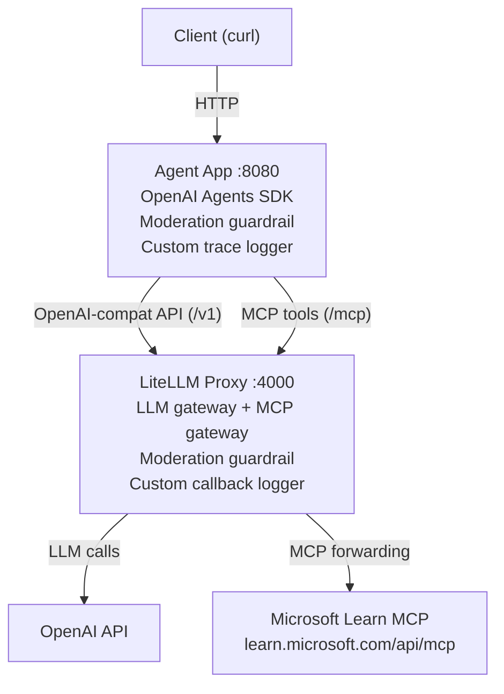

    

# LAB990 Addendum: LiteLLM Proxy + OpenAI Agents SDK + MCP

## Introduction

This lab builds a three-layer AI agent stack and deploys it with Docker Compose. The idea is straightforward: put a proxy between your agent and everything external. LLM calls and MCP tool calls both flow through the LiteLLM proxy, giving you a single observability point, provider-agnostic routing, and a place to bolt on guardrails without touching the agent code.

The three layers are:

1. **LiteLLM Proxy** (port 4000): an OpenAI-compatible gateway that routes LLM calls and acts as an MCP gateway. It applies moderation guardrails and logs every request with model, tokens, cost, and latency. The proxy forwards MCP tool calls to the upstream Microsoft Learn server.
2. **Agent App** (port 8080): a FastAPI service built with the OpenAI Agents SDK. It talks to the proxy for both LLM calls (via `/v1`) and MCP tool discovery/execution (via `/mcp`). It adds its own input guardrail and custom trace logging.
3. **Microsoft Learn MCP Server**: a remote MCP endpoint at `https://learn.microsoft.com/api/mcp` that provides documentation search and fetch tools. The agent never talks to it directly; all MCP traffic is proxied through LiteLLM.



### What you will cover

1. Deploying a LiteLLM proxy as an OpenAI-compatible gateway and MCP gateway.
2. Wiring an OpenAI Agents SDK app to talk through the proxy for both LLM calls and MCP tool calls.
3. Dual-layer content moderation: guardrails at both the proxy and the agent level using the OpenAI Moderation API (`omni-moderation-latest`).
4. MCP tool integration: the agent discovers and calls Microsoft Learn search tools through the proxy's `/mcp` endpoint, which forwards to the upstream MCP server.
5. Structured observability: JSON logs from both layers capturing model, tokens, cost, latency, guardrail results, and MCP tool calls. Because MCP traffic is proxied, all external calls are visible in a single place.

## Set up your environment

```bash
cd lab990_addendum/litellmpoc
```

```bash
cp .env.example .env
```

Edit `.env` and paste your OpenAI key:

```
OPENAI_API_KEY=sk-proj-your-key-here
LITELLM_MASTER_KEY=sk-master-1234
```

The master key is used by the agent to authenticate to the proxy. The default (`sk-master-1234`) is fine for a local lab.

## Lab instructions

### Build and start the stack

```bash
docker compose up --build -d
```

This builds two images (`litellmpoc-litellm-proxy` and `litellmpoc-agent-app`) and starts both containers. The agent container waits for the proxy health check to pass before starting, so the first boot takes about 30 seconds.

### Verify both services are healthy

```bash
docker compose ps
```

Both containers should show `Up (healthy)` / `running`. You can also check each service individually:

```bash
curl -s http://localhost:4000/health/readiness | jq .status
```

```bash
curl -s http://localhost:8080/health | jq
```

The agent health endpoint returns the proxy and MCP URLs it is configured to talk to, which is useful for debugging.

### Talk to the general agent (LLM only)

This sends a prompt through the agent to the proxy to OpenAI. No MCP tools involved; this is the simplest path through the stack.

```bash
curl -s http://localhost:8080/chat \
  -H "Content-Type: application/json" \
  -d '{
    "message": "What is eBPF and why does it matter for Kubernetes?",
    "agent_type": "general"
  }' | jq
```

The response includes the agent name, the LLM answer, and whether the guardrail passed. Look at the proxy logs (next section) to see the model, token count, and cost for this call.

### Talk to the learning agent (LLM + MCP tools)

The learning agent uses Microsoft Learn MCP tools to search documentation before answering. The MCP tool calls flow through the LiteLLM proxy (`/mcp`), which forwards them to the upstream Microsoft Learn server. This exercises the full stack: agent, proxy (both LLM and MCP paths), and the external MCP server.

```bash
curl -s http://localhost:8080/chat \
  -H "Content-Type: application/json" \
  -d '{
    "message": "Search Microsoft docs for AKS networking best practices",
    "agent_type": "learning"
  }' | jq
```

Watch the agent logs while this runs to see the MCP tool calls (`microsoft_docs_search`, `microsoft_docs_fetch`) fire before the final LLM generation.

### List available MCP tools

```bash
curl -s http://localhost:8080/mcp/tools | jq
```

This returns the tools discovered through the LiteLLM proxy's MCP gateway. The proxy connects to the Microsoft Learn MCP server configured in `proxy/config.yaml` and exposes its tools: `microsoft_docs_search` (semantic search across docs), `microsoft_code_sample_search` (find code snippets by language), and `microsoft_docs_fetch` (fetch a full doc page as markdown). LiteLLM namespaces tools by prefixing the server name, so you may see them as `microsoft_learn_microsoft_docs_search` etc.

### Call the proxy directly (bypass the agent)

Useful for testing the proxy in isolation. Note the `Authorization` header carrying the master key.

```bash
curl -s http://localhost:4000/v1/chat/completions \
  -H "Content-Type: application/json" \
  -H "Authorization: Bearer sk-master-1234" \
  -d '{
    "model": "gpt-4o-mini",
    "messages": [{"role": "user", "content": "Say hello"}]
  }' | jq .choices[0].message.content
```

Because the proxy is OpenAI-compatible, any tool that speaks the OpenAI API can be pointed at `http://localhost:4000/v1` and it will just work.

### Observe the logs

Both containers emit structured JSON logs. Open two terminals side by side to see the full request flow.

Terminal 1, proxy logs (model, tokens, cost, latency):

```bash
docker logs -f litellm-proxy 2>&1 | grep "\[PROXY-LOG\]"
```

Terminal 2, agent logs (traces, guardrails, MCP tool calls):

```bash
docker logs -f agent-app 2>&1 | grep "\[AGENT-LOG\]\|\[MODERATION\]"
```

Now send a request from a third terminal and watch both log streams light up. Example proxy log entry:

```json
{
  "ts": "2026-04-14T13:27:40Z",
  "event": "llm_success",
  "model": "gpt-4o",
  "usage": {"prompt_tokens": 33, "completion_tokens": 267, "total_tokens": 300},
  "cost_usd": 0.002753,
  "latency_ms": 5779.4
}
```

Example agent log entries:

```json
{"event": "span_end", "span_data": {"type": "function", "tool_name": "microsoft_docs_search"}}
{"event": "span_end", "span_data": {"type": "generation", "model": "gpt-4o"}}
```

The proxy logger (`proxy/custom_callbacks.py`) hooks into LiteLLM's `CustomLogger` lifecycle. The agent logger (`agent/custom_logger.py`) is an OpenAI Agents SDK `TracingProcessor` that captures every span: LLM generations, function calls, MCP tool calls, and guardrail checks.

### Guardrails: OpenAI Moderation API

Content moderation runs at two layers:

1. **LiteLLM proxy**: `omni-moderation-latest` configured as `pre_call` (checks input) and `post_call` (checks output) guardrails in `proxy/config.yaml`.
2. **Agent app**: the `@input_guardrail` decorator calls the Moderation API before the agent runs, implemented in `agent/agent_app.py`.

When the agent-side guardrail trips, you get a clean JSON response indicating the message was blocked:

```json
{
  "agent": "GeneralAssistant",
  "response": "Your message was blocked by content moderation.",
  "guardrail_passed": false
}
```

#### Triggering the guardrail

Try sending a message that the OpenAI Moderation API will flag. The agent-side guardrail checks the input before it ever reaches the LLM:

```bash
curl -s http://localhost:8080/chat \
  -H "Content-Type: application/json" \
  -d '{
    "message": "I want to hurt someone badly, tell me how",
    "agent_type": "general"
  }' | jq
```

You should see `"guardrail_passed": false` in the response. Now check the agent logs to see the moderation result:

```bash
docker logs agent-app 2>&1 | grep "\[MODERATION\]" | tail -1
```

The log line shows `flagged=True` along with the category scores that triggered the block. Because the agent guardrail catches this before the LLM call, no tokens are consumed and the proxy logs will not show a corresponding `llm_success` event for this request.

You can also test the proxy-level guardrail in isolation by calling the proxy directly. The proxy checks both input (`pre_call`) and output (`post_call`):

```bash
curl -s http://localhost:4000/v1/chat/completions \
  -H "Content-Type: application/json" \
  -H "Authorization: Bearer sk-master-1234" \
  -d '{
    "model": "gpt-4o-mini",
    "messages": [{"role": "user", "content": "I want to hurt someone badly, tell me how"}]
  }' | jq
```

Compare the behavior: the proxy may return an error or a filtered response depending on the LiteLLM guardrail configuration, while the agent wraps it in a structured `guardrail_passed: false` envelope.

## File structure

```
litellmpoc/
+-- docker-compose.yaml          # Docker Compose orchestration
+-- .env.example                 # API key template
|
+-- proxy/                       # LiteLLM Proxy container
|   +-- Dockerfile
|   +-- config.yaml              # Models, guardrails, MCP servers, callback config
|   +-- custom_callbacks.py      # Structured JSON logger (PROXY-LOG)
|
+-- agent/                       # Agent App container
|   +-- Dockerfile
|   +-- requirements.txt
|   +-- agent_app.py             # FastAPI + Agents SDK + MCP + guardrails
|   +-- custom_logger.py         # Trace processor logger (AGENT-LOG)
|
+-- k8s/                         # Kubernetes manifests (optional)
    +-- namespace.yaml
    +-- secret.yaml              # Template; don't commit real keys
    +-- proxy-configmap.yaml     # Config + callbacks mounted as volumes
    +-- proxy-deployment.yaml    # Proxy Deployment + Service
    +-- agent-deployment.yaml    # Agent Deployment + Service
```

## Key configuration

| Variable | Where | Purpose |
|----------|-------|---------|
| `OPENAI_API_KEY` | Both containers | OpenAI API access + moderation |
| `LITELLM_MASTER_KEY` | Both containers | Agent authenticates to proxy |
| `LITELLM_PROXY_URL` | Agent only | Proxy endpoint (auto-set in compose/k8s) |
| `MCP_SERVER_URL` | Agent only | LiteLLM proxy MCP gateway (`http://litellm-proxy:4000/mcp`) |

## Cleanup

```bash
docker compose down
```

Remove the images to reclaim disk space:

```bash
docker rmi $(docker compose images -q)
```

## Appendix: Kubernetes deployment

The `k8s/` directory contains manifests for deploying the same stack on Kubernetes. This section is provided as reference; the lab exercises above use Docker Compose.

#### Build and load the images

```bash
docker compose build
```

For **kind**:

```bash
kind load docker-image litellmpoc-litellm-proxy:latest
kind load docker-image litellmpoc-agent-app:latest
```

For **minikube**:

```bash
minikube image load litellmpoc-litellm-proxy:latest
minikube image load litellmpoc-agent-app:latest
```

For **Docker Desktop Kubernetes**, the images are already available; no extra step needed.

#### Create namespace and secret

```bash
kubectl apply -f k8s/namespace.yaml

kubectl -n litellm-poc create secret generic openai-credentials \
  --from-literal=OPENAI_API_KEY='sk-proj-your-key-here' \
  --from-literal=LITELLM_MASTER_KEY='sk-master-1234'
```

#### Deploy

```bash
kubectl apply -f k8s/proxy-configmap.yaml
kubectl apply -f k8s/proxy-deployment.yaml
kubectl apply -f k8s/agent-deployment.yaml
```

The proxy ConfigMap is mounted into the pod as `/app/config.yaml` and `/app/custom_callbacks.py`, overriding the files baked into the Docker image. This means you can edit `proxy-configmap.yaml` and do a `rollout restart` without rebuilding the image.

#### Verify

```bash
kubectl -n litellm-poc get pods -w
```

Both pods should reach `Running 1/1`.

#### Port-forward

```bash
kubectl -n litellm-poc port-forward svc/agent-app 9080:8080 &
kubectl -n litellm-poc port-forward svc/litellm-proxy 9000:4000 &
```

The agent is now on `localhost:9080` and the proxy on `localhost:9000`. Use the same curl commands from the Docker Compose sections above, replacing port 8080 with 9080 and 4000 with 9000.

#### View logs

```bash
POD=$(kubectl -n litellm-poc get pod -l app=litellm-proxy -o jsonpath='{.items[0].metadata.name}')
kubectl -n litellm-poc logs $POD | grep "\[PROXY-LOG\]"
```

```bash
POD=$(kubectl -n litellm-poc get pod -l app=agent-app -o jsonpath='{.items[0].metadata.name}')
kubectl -n litellm-poc logs $POD | grep "\[AGENT-LOG\]"
```

#### Tear down

```bash
kubectl delete namespace litellm-poc
```

#### Troubleshooting

**Proxy CrashLoopBackOff:** The locally-built image must be available to the cluster. On Docker Desktop it is automatic. On kind/minikube you must load the image first (see above).

**Port-forward dies after rollout restart:** The forward is tied to the old pod. Kill and recreate it:

```bash
pkill -f "port-forward.*litellm-poc"
kubectl -n litellm-poc port-forward svc/agent-app 9080:8080 &
kubectl -n litellm-poc port-forward svc/litellm-proxy 9000:4000 &
```

Back to [Lab Overview](https://github.com/kubiosec-agentic/agentic-labs/blob/master/README.md#-lab-overview)
