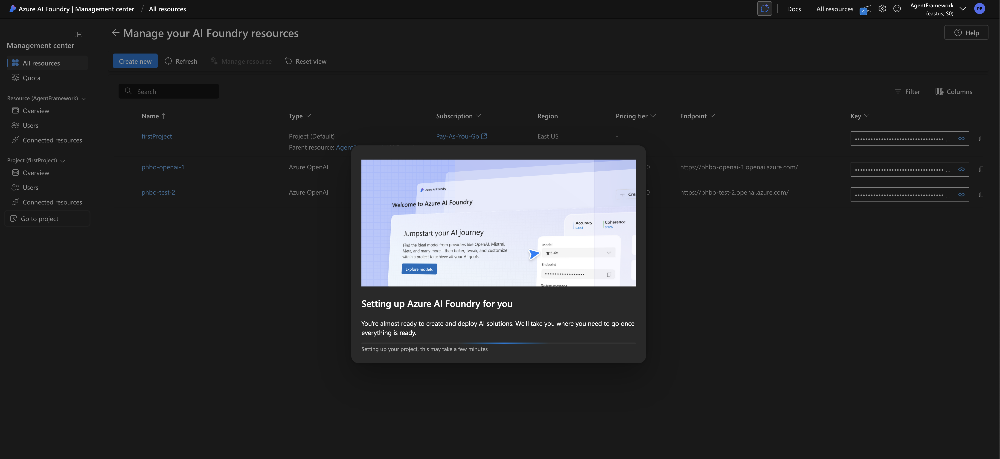
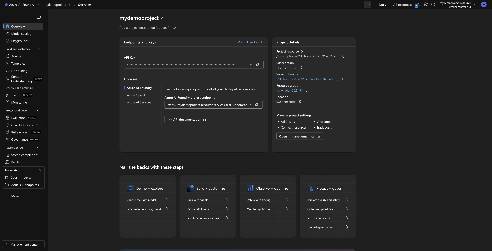
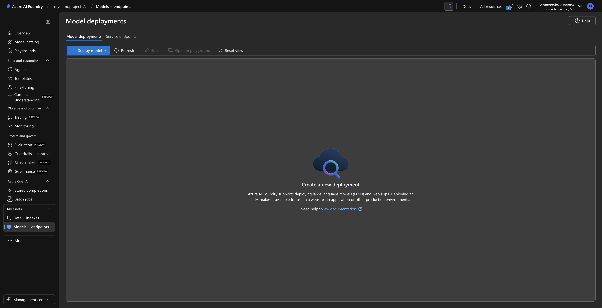
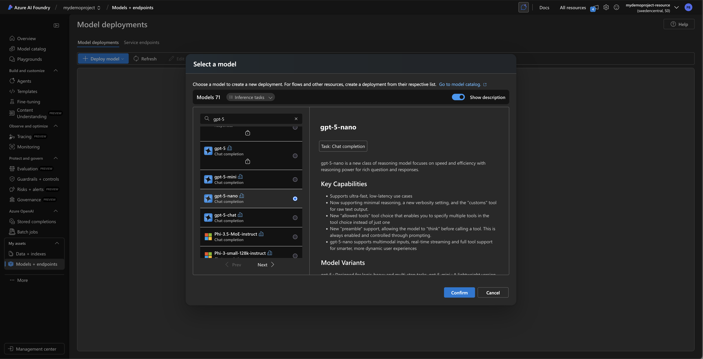
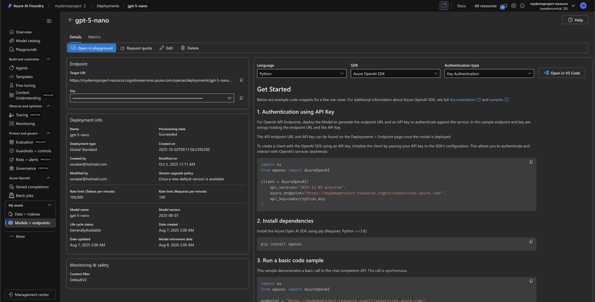

# Microsoft Agent Framework (Addendum)

Reference examples for the Microsoft Agent Framework 1.0 GA Python API.
These scripts complement the hands-on exercises in **lab075_MS_Agent_Framework**.

> For the full documentation see <https://github.com/microsoft/agent-framework/>

## 1.0 GA Breaking Changes

The 1.0 GA release introduced several breaking changes from the pre-release API:

- `ChatAgent` removed, replaced by `Agent` (with `client=` instead of `chat_client=`)
- `AzureAIAgentClient` removed; use `FoundryChatClient` from `agent_framework.foundry`
- `HostedCodeInterpreterTool`, `HostedWebSearchTool` removed; use `client.get_code_interpreter_tool()` etc.
- `ChatMessage` renamed to `Message` (with `contents=` instead of `text=`)
- `model_id=` renamed to `model=` everywhere
- `run_stream()` replaced by `run(stream=True)`
- Separate packages: `agent-framework-core`, `agent-framework-openai`, `agent-framework-foundry`

See the full migration guide:
<https://learn.microsoft.com/en-us/agent-framework/support/upgrade/python-2026-significant-changes>

## Azure AI Foundry Setup

1. Go to <https://ai.azure.com> and **Sign In**

   

2. Create a new Azure AI Foundry resource and a project

   

3. Go to Models + endpoints, deploy a base model

   
   

4. Note the deployment name

   

5. Set your environment variables:

```bash
export FOUNDRY_PROJECT_ENDPOINT="https://<project>.services.ai.azure.com"
export FOUNDRY_MODEL="gpt-4o"
```

6. Authenticate with the Azure CLI:

```bash
az login
```

## Installation

```bash
python3 -m venv .venv
source .venv/bin/activate
pip install -r requirements.txt
```

Or install packages individually:

```bash
# For Azure Foundry examples
pip install agent-framework-foundry azure-identity

# For OpenAI examples
pip install agent-framework-openai
```

## Scripts

### openai_agent.py

Minimal example using `OpenAIChatClient().as_agent()` with a weather tool.

```bash
export OPENAI_API_KEY="sk-..."
export OPENAI_CHAT_MODEL="gpt-4o-mini"
python3 openai_agent.py
```

### azure_agent.py

Uses `FoundryChatClient` + `Agent` with streaming and non-streaming examples.

```bash
python3 azure_agent.py
```

### azure_agent_mcp.py

Connects to an HTTP-based MCP server (Microsoft Learn docs) and queries it.

```bash
python3 azure_agent_mcp.py
```

### azure_code_interpreter.py

Uses `client.get_code_interpreter_tool()` to execute Python code server-side.

```bash
python3 azure_code_interpreter.py
```

### openai_workflow.py

Demonstrates `WorkflowBuilder` with a Worker/Reviewer cycle wrapped as an agent
via `.as_agent()`. The Worker generates responses and the Reviewer evaluates them,
iterating until approval.

```bash
python3 openai_workflow.py
```

## Cleanup

```bash
deactivate
rm -rf .venv
```
